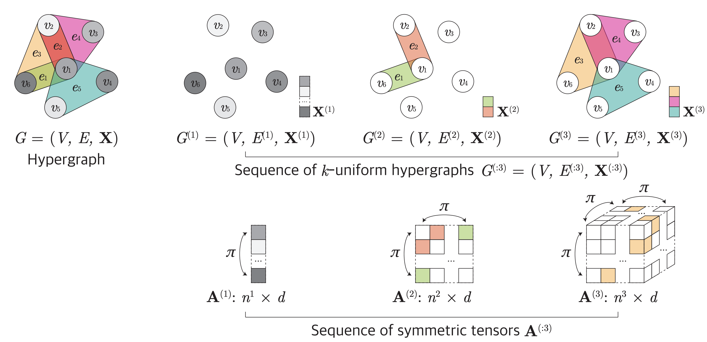

# Equivariant Hypergraph Neural Networks (to be released)

We are planning to release the code during July.

**Equivariant Hypergraph Neural Networks** \
[Jinwoo Kim](https://bit.ly/3pPuyIb), [Saeyoon Oh](https://github.com/saeyoon17), [Sungjun Cho](https://scholar.google.com/citations?user=bEilQPMAAAAJ&hl=en), [Seunghoon Hong](https://maga33.github.io/) \
To appear at ECCV 2022

